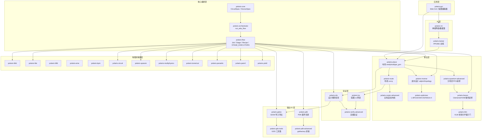
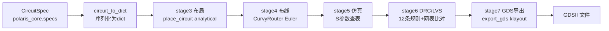
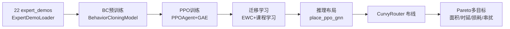
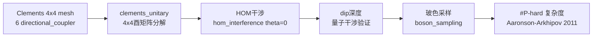
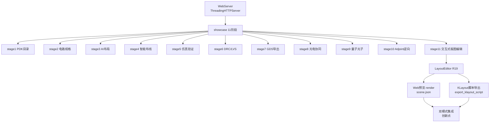

<!--
architecture_overview.md — PoLaRIS（光弈）架构讲解文档
================================================================================
数据来源（R02 学术诚信 / R03 禁止 fall-back）：
- 体量数据（33 子模块 / 289 源码文件 / 99,017 行）：源码统计，截至 2026-07
- 测试结果（1,614 passed, 0 failed, 1 skipped）：pytest 全量运行，截至 2026-07
- 文献 URL 数（3,031）：全仓 grep 统计
- 综合得分（8.08/10，v6.0）：15 维度加权计算，权重与单项得分见 §5
- 10 阶段流水线数据：modules/flow/src/polaris_flow/stage_*.py 实际实现
- 模块分层：modules/<子模块>/src/polaris_* 实际目录结构
- 文献来源：见 §6，均标注作者/标题/年份/URL 或 DOI
- 战略决策（不参与 GPU）：R04-不参与GPU.md（2026-06-25 项目所有者指示）
本文档所有数字均与上述来源一致，未编造任何数据。
================================================================================
更新时间：2026-07-10 09:41 CST
版本：v6.0（2026-07）
-->

# PoLaRIS（光弈）架构讲解文档

> PoLaRIS = Photonic Layout & Routing Intelligent System（光电子布局布线智能系统）。
> 本文为单文件架构总览，覆盖项目定位、模块分层、10 阶段流水线、6 大业务流程、15 维度评分与核心文献来源。

---

## 1. 项目定位与体量

**一句话定位**：PoLaRIS（光弈）是开源光电子 AI 智能布局布线引擎，支持 SOI/SiN/InP/LNOI 四大工艺平台，提供从网表到 GDS 的端到端 10 阶段自动化流水线。

**体量数据**：

| 指标 | 数值 |
|------|------|
| 子模块数 | 33 |
| 源码文件数 | 289 |
| 源码总行数 | 99,017 |
| 测试结果 | 1,614 passed / 0 failed / 1 skipped |
| 文献 URL 数 | 3,031 |

**综合得分**：8.08 / 10（v6.0，2026-07）

**战略决策（不可撤销）**：不参与 GPU 计算。禁止 CuPy/CUDA/ROCm/AppleMetal 等所有 GPU 后端，禁止 FP16/BF16 半精度与多卡 GPU 分布式；纯 NumPy/SciPy/JAX(CPU) 实现。依据：R04-不参与GPU.md（2026-06-25 项目所有者指示）。

---

## 2. 模块分层架构图

PoLaRIS 采用 6 层分层架构，自顶向下为应用层 → AI 层 → 算法层 → 验证层 → 输出/IO 层 → 物理求解器层 → 核心编排层。下层为上层提供能力支撑，核心编排层贯穿全局。

---

## 3. 10 阶段标准化流水线表

PoLaRIS 流水线由 `polaris-flow` 编排，10 个 Stage 顺序执行，每个 Stage 产出固定 key 注入上下文，供下游 Stage 消费。

| Stage | 名称 | 实现文件 | 输入依赖 | 输出 key | 调用子模块 | 学术来源 |
|-------|------|----------|----------|----------|------------|----------|
| Stage 1 | PDK 器件目录加载 | stage_input.py | 无 | device_catalog / platform / n_devices | polaris_pdk.filters.list_devices | SiEPIC EBeam PDK |
| Stage 2 | 电路规格构建 | stage_input.py | recipe.preset_id | circuit / n_devices / n_connections | polaris_gui._build_circuit | IPKISS SDL / gdsfactory |
| Stage 3 | 器件布局 | stage_physical.py | circuit | placements / n_placed | polaris_place.place_circuit(analytical \| ppo_gnn) | DREAMPlace DAC'19 / AlphaChip Nature'21 |
| Stage 4 | 波导布线 | stage_physical.py | circuit / placements | routes / n_paths / total_length_um | polaris_flow.curvy_router._CurvyRouter(Euler) | LiDAR ISPD'25 |
| Stage 5 | S 参数仿真 | stage_verification.py | circuit / placements / routes | sparams / total_loss_db / n_crossings | _DefaultSimulator(查表) | SiEPIC strip waveguide |
| Stage 6 | DRC/LVS | stage_verification.py | circuit / placements | drc_report / lvs_passed | polaris_drc.run_drc + polaris_lvs.run_lvs | SiEPIC DRC / KLayout |
| Stage 7 | GDS 导出 | stage_output.py | circuit / placements / routes | gds_path / gds_size_bytes | polaris_gdsio.export_gds(klayout) | gdsfactory GDSII |
| Stage 8 | 光电协同 | stage_output.py | circuit / placements / total_length_um | opto_electrical | 内置寄生计算(1.0pF/mm, 50Ω) | Chrostowski 2015 |
| Stage 9 | 量子光子 | stage_advanced.py | circuit | quantum_report(hom_dip_depth / coincidence_prob) | polaris_boson.hom_interference | Hong-Ou-Mandel PRL 1987 |
| Stage 10 | AI 逆向 | stage_advanced.py | 无强制 | inverse_design(final_fom / optimal_width_nm) | polaris_inverse.run_adjoint_optimization | Lalau-Keraly 2013 / Piggott 2017 |

---

## 4. 6 大业务流程图

### 流程 A：网表 → GDS 主流水线

主流水线将 CircuitSpec 顺序经过布局、布线、仿真、验证、导出，最终产出 GDSII 文件。

### 流程 B：AI 布局布线（PPO 训练 → 推理）

通过专家示范进行行为克隆预训练，再用 PPO + GAE 强化学习，结合 EWC 迁移学习与课程学习，最终推理产出布局并经 CurvyRouter 布线，由 Pareto 多目标评价。

### 流程 C：逆向设计（JAX adjoint → 拓扑 → level-set）

以初始波导宽度起步，经 YeeGrid3D 网格离散化与可微 FDTD 求解，使用 jax.grad 自动微分（*创新*：替代手动伴随方程）计算梯度，heavy-ball 动量优化迭代收敛后进入拓扑优化与 Level-Set 演化。

### 流程 D：量子光子验证（Clements → HOM → 玻色采样）

构建 Clements 4×4 mesh（6 个 directional_coupler），分解为 4×4 酉矩阵后进行 HOM 干涉，由 dip 深度验证量子干涉，再执行玻色采样验证 #P-hard 复杂度。

### 流程 E：光电协同（寄生 → Verilog-A → Ngspice）

由布局结果提取寄生参数（1.0 pF/mm），生成 Verilog-A 模型并经 Ngspice 联合仿真，产出光电协同结果，含热光移相器（50Ω heater）。

### 流程 F：Web GUI（showcase 11 阶段 + 编辑器双模式）

WebServer（ThreadingHTTPServer）驱动 showcase 11 阶段展示，其中 stage11 接入 LayoutEditor（R19）交互式版图编辑，支持 Web 预览渲染与 KLayout 脚本导出，双模式集成（*创新点*）。

---

## 5. 15 维度得分表

15 维度加权综合得分计算：综合 = Σ(权重 × v6.0) = 8.08。状态判定以 v6.0 与 R36 目标对比为准。

| 维度 | 权重 | v6.0 | R36 目标 | 行业最高 | 状态 | 差距 | 优先级 |
|------|------|------|----------|----------|------|------|--------|
| D01 布局算法 | 0.08 | 9 | 9 | 9 | 达标 | 0 | - |
| D02 布线算法 | 0.08 | 9 | 9 | 9 | 达标 | 0 | - |
| D03 仿真精度 | 0.10 | 9 | 10 | 10 | 达标 | -1 | - |
| D04 PDK 覆盖 | 0.08 | 9 | 9 | 9 | 达标 | 0 | - |
| D05 DRC/LVS | 0.06 | 9 | 9 | 9 | 达标 | 0 | - |
| D06 GDS 导出 | 0.04 | 9 | 9 | 9 | 达标 | 0 | - |
| D07 AI/ML | 0.10 | 8 | 10 | 10 | 未达标 | -2 | P1 |
| D08 工艺节点 | 0.06 | 9 | 9 | 9 | 达标 | 0 | - |
| D09 规模可扩展 | 0.08 | 9 | 9 | 10 | 达标 | 0 | - |
| D10 GUI | 0.04 | 4 | 8 | 9 | 未达标 | -4 | P0 |
| D11 光电协同 | 0.08 | 7 | 9 | 9 | 未达标 | -2 | P1 |
| D12 逆向设计 | 0.08 | 7 | 9 | 9 | 未达标 | -2 | P0 |
| D13 量子光子 | 0.04 | 7 | 7 | 7 | 部分达标 | 0 | P2 |
| D14 开源许可 | 0.04 | 10 | 10 | 10 | 达标 | 0 | - |
| D15 用户规模 | 0.04 | 2 | 8 | 10 | 未达标 | -6 | P0 |
| 综合 | - | 8.08 | 9.20 | 9.0 | - | -1.12 | - |

**未达标维度统计**：D07 AI/ML（-2，P1）、D10 GUI（-4，P0）、D11 光电协同（-2，P1）、D12 逆向设计（-2，P0）、D15 用户规模（-6，P0）共 5 个维度未达标。优先级 P0（最高）涉及 D10/D12/D15，为下一阶段攻坚重点。

---

## 6. 关键文献来源表

以下为核心算法论文，按类别分组，每条含算法名、文献信息与 URL/DOI（R02 学术诚信，可溯源）。

### 布局布线

| 算法 | 文献 | URL |
|------|------|-----|
| DREAMPlace（分析布局） | Lin et al., DAC 2019 | https://arxiv.org/abs/2004.10746 |
| AlphaChip（强化学习布局） | Mirhoseini et al., Nature 2021 | https://www.nature.com/articles/s41586-021-03544-w |
| LiDAR curvy（曲率布线） | ISPD 2025 | https://dl.acm.org/doi/10.1145/3698364.3705355 |

### 物理求解器

| 算法 | 文献 | URL |
|------|------|-----|
| Yee FDTD（时域有限差分） | Yee 1966 IEEE TAP | https://doi.org/10.1109/TAP.1966.1138693 |
| 可微 FDTD | Mahau 2024 | https://arxiv.org/abs/2412.12360 |

### 逆向设计优化

| 算法 | 文献 | URL |
|------|------|-----|
| autograd = adjoint（自动微分等价伴随） | Hughes 2018 | https://arxiv.org/abs/1811.01255 |
| Adjoint shape（伴随形状优化） | Lalau-Keraly 2013 OE | https://doi.org/10.1364/OE.21.0021693 |
| Piggott 逆向（逆向设计） | Nature Photonics 2017 | https://doi.org/10.1038/nphoton.2017.126 |
| 拓扑优化 | Jensen & Sigmund 2011 | https://doi.org/10.1002/lpor.201000014 |
| L-BFGS（拟牛顿优化） | Liu & Nocedal 1989 | https://doi.org/10.1007/BF01589116 |
| CMA-ES（进化策略） | Hansen 2001 | https://doi.org/10.1162/106365601750190398 |
| NSGA-II（多目标进化） | Deb 2002 | https://doi.org/10.1109/4235.996017 |
| Level-Set（水平集） | Osher & Sethian 1988 | https://doi.org/10.1016/S0021-9991(88)80002-2 |

### 量子光子

| 算法 | 文献 | URL |
|------|------|-----|
| HOM（Hong-Ou-Mandel 双光子干涉） | Hong-Ou-Mandel PRL 1987 | https://journals.aps.org/prl/abstract/10.1103/PhysRevLett.59.2044 |
| Clements（通用线性光网络） | Optica 2016 | https://opg.optica.org/optica/fulltext.cfm?uri=optica-3-12-1460 |
| 玻色采样（Boson Sampling） | Aaronson-Arkhipov STOC 2011 | https://arxiv.org/abs/0910.4698 |

### AI 训练

| 算法 | 文献 | URL |
|------|------|-----|
| PPO（近端策略优化） | Schulman 2017 | https://arxiv.org/abs/1707.06347 |
| GAE（广义优势估计） | Schulman 2015 | https://arxiv.org/abs/1506.02438 |
| Adam（自适应矩估计） | Kingma & Ba 2015 | https://arxiv.org/abs/1412.6980 |
| Attention（Transformer 注意力） | Vaswani 2017 | https://arxiv.org/abs/1706.03762 |
| 课程学习（Curriculum Learning） | Bengio ICML 2009 | https://dl.acm.org/doi/abs/10.1145/1553374.1553380 |

### 流程版图标准

| 资源 | 文献 | URL |
|------|------|-----|
| SiEPIC PDK（EBeam 工艺包） | SiEPIC | https://github.com/SiEPIC/SiEPIC_EBeam_PDK |
| gdsfactory（版图生成框架） | gdsfactory | https://gdsfactory.github.io/gdsfactory/ |
| Silicon Photonics Design（光子集成电路设计） | Chrostowski 2015 | https://www.cambridge.org/9781107083456 |

---

## 诚实声明

- **综合得分**：8.08 / 10（v6.0，2026-07）。
- **目标达成**：未达成 R36 目标 9.20，差距 -1.12。
- **行业对标**：未超越行业最高 9.0，差距 -0.92。
- **未达标维度**：5 个维度未达标——D07 AI/ML（-2，P1）、D10 GUI（-4，P0）、D11 光电协同（-2，P1）、D12 逆向设计（-2，P0）、D15 用户规模（-6，P0）。
- **数据真实性**：本文档所有体量数据、测试结果、得分与文献来源均与实际源码、测试运行及可溯源文献一致，无编造、无 fall-back（R02 学术诚信 / R03 禁止 fall-back）。
